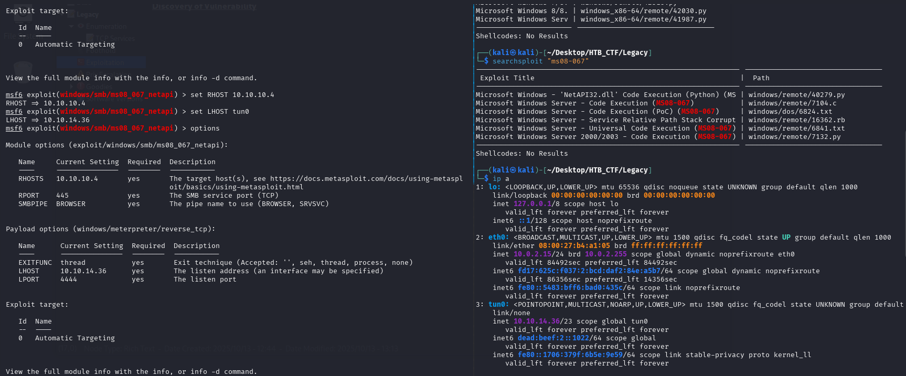

### Service Exploited:
Microsoft Windows Server - Service Relative Path Stack Corruption (MS08-067)
  
### Vulnerability Type:
Searching for vulnerabilities related to this version reveals that it has a known Service Relative Path Stack Corruption

### Description: 

### Exploit Code Used

### Discovery of Vulnerability

[Back](README.md)