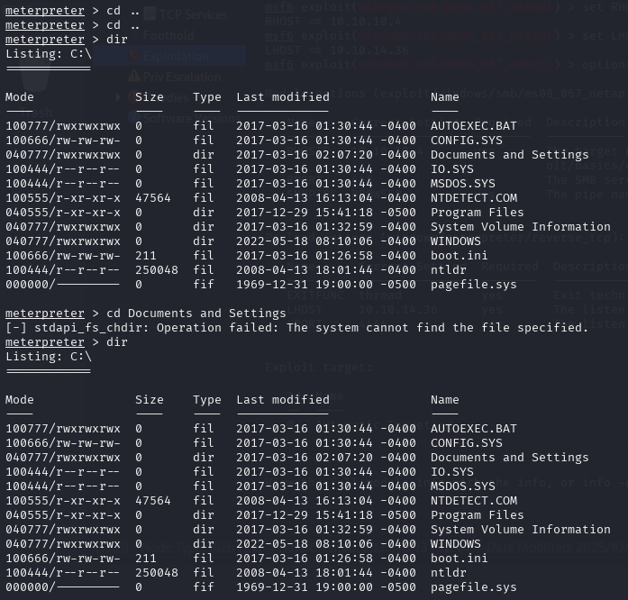
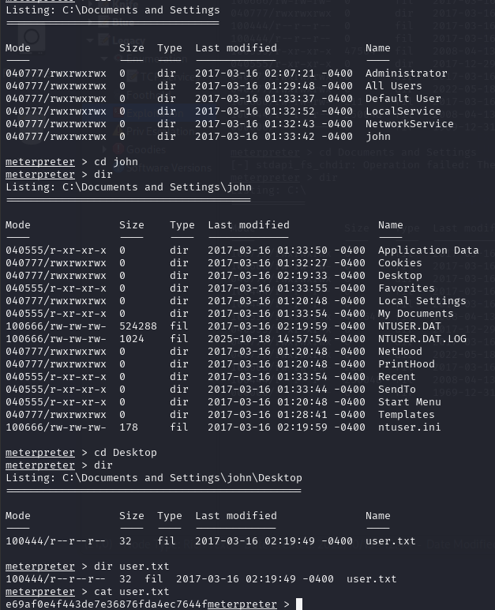
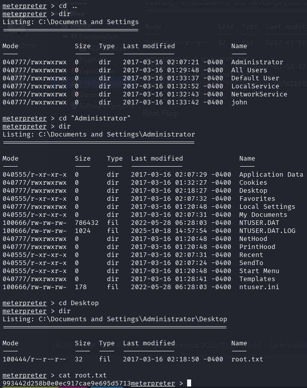

Once we know which Metasploit module to use, we fill out the required fields (see options module)

Once all the Metasploit module options are completed, we run it and obtain the meterpreter connection. Now we will list directories to see if we get the user and root flag.

User flag:

Root Flag:

[Back](README.md)