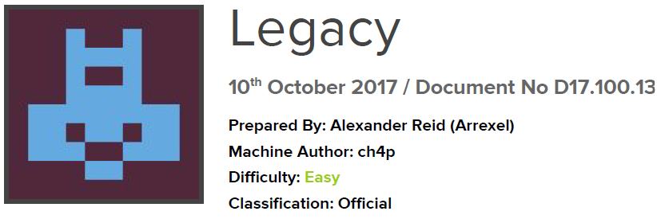

# Scope

Legacy is a beginner-level machine which demostrates the potential security risks of SMB on Windows.
Only one publicly available exploit is required to obtain administrator access.

# Index
- [Enumeration](Enumeration.md)
- [Foothold](Foothold.md)
- [Exploitation](Exploitation.md)
- [Priv Escalation](Priv_Escalation.md)
- [Software Versions](Software_Versions.md)

Go back to [Hack-The-Box_CTF](https://github.com/ChusLee/Hack-The-Box_CTF)