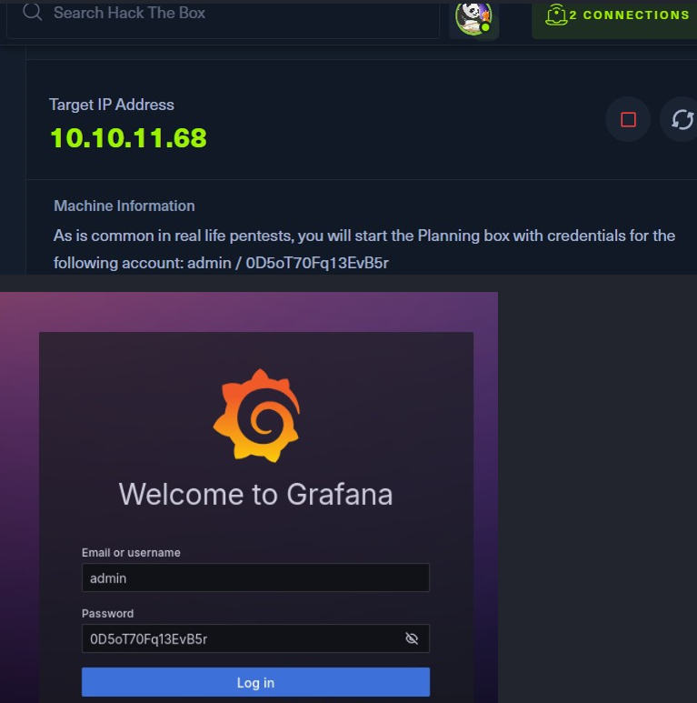
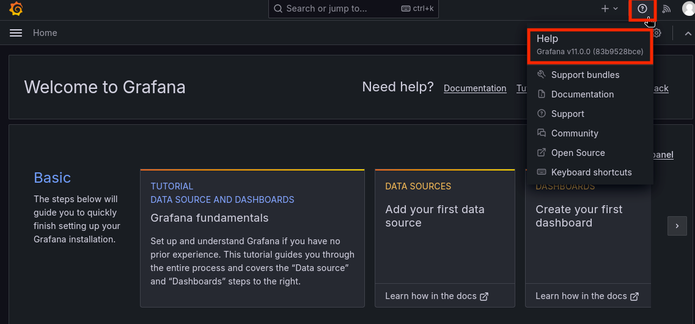

We are redirected to the Grafana login page. Grafana is an open-source tool for visualizing, monitoring, querying, and analyzing metrics from data sources through interactive dashboards. As is common in reallife penetration tests, we were provided the following credentials to log in: admin:0D5oT70Fq13EvB5r .

Upon logging in, we see the Grafana dashboard, and by hovering over the help icon on the top right, we identify that the version is v11.0.0 .

A quick search reveals that this version is vulnerable to command injection and local file inclusion due to the experimental SQL Expressions feature introduced in it. This vulnerability has been assigned CVE-2024-9264.

[Back](README.md)