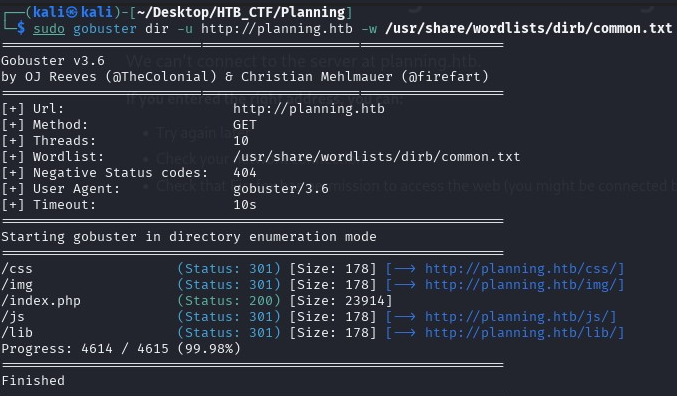
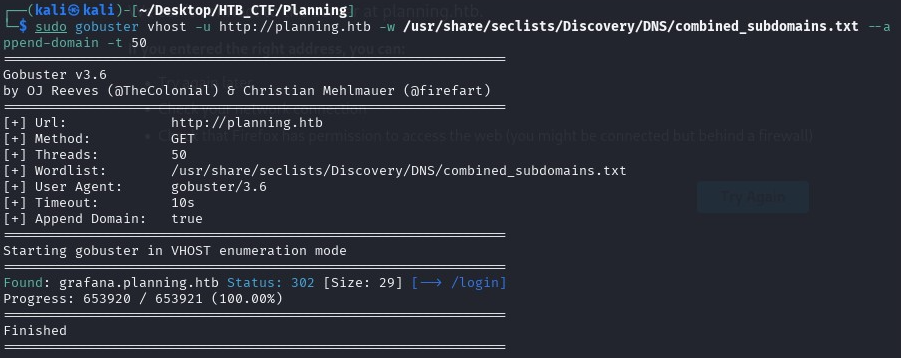

The Gobuster tool will allow us to scan for hidden resources such as subdomains, directories, and parameters.
Let's look for hidden subdomains. To construct our command, we will need to specify:

-u → The target URL to Gobuster. 

-w → Wordlist of potential subdomains to test.

Does not reveal anything of interest, so we can try to scan with vhost command;

Gobuster vhost →  uses Gobuster in VHOST mode to discover virtual hosts (subdomains that point to the same server).

-u → http://planning.htb: target URL, the main domain to test.

-w →  /usr/share/seclists/Discovery/DNS/combined_subdomains.txt: wordlist containing possible subdomain names to try.

-append-domain → automatically appends the main domain to each word in the list (for example, if the word is “grafana,” it tests “grafana.planning.htb”).

-t 50 →  number of threads (parallel requests) to speed up the scan.

After a few moments, we see the subdomain grafana , which we will add to our /etc/hosts file as follows to access the site in our browser.

[Back](README.md)