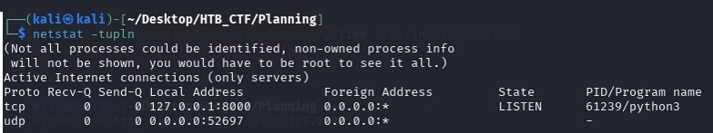
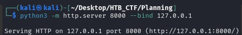
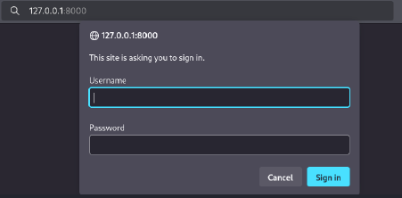
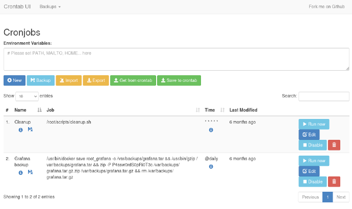
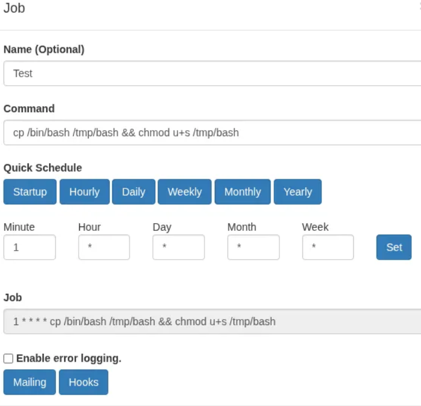
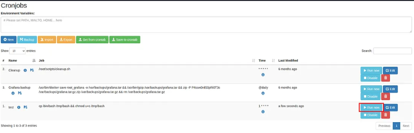
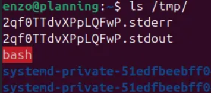
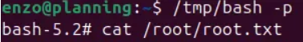

Now we can move on to final privilege escalation. To start our enumeration, we will check all active listening ports on the machine with netstat . More specifically, we will use the following parameters to show:

-t → TCP connections.

-u → UDP connections.

-l  → Only listening sockets (ports that are waiting for connections).

-n → Numeric addresses/ports (instead of resolving hostnames or service names).

-p → PID and process name of the program bound to each socket.



Let's find the service running on port 8000 by port forwarding it to our machine.



We can try to access it locally from our browser.



We are required to sign in, but none of the credentials we have thus far have been successful. So we will have to keep enumerating.
In the /opt directory we find an interesting folder crontabs that we can read.
Inside it we find crontab.db which we can read as well.


We found another plaintext password.

Password: P4ssw0rdS0pRi0T3c

User: we supose that is “root”

We can log in and see the custom interface. We can view the current .db file and also create a new one.



Knowing that these tasks run as root, we can create a new cron job to execute any command with elevated privileges.

To take advantage of this, we’ll modify the permissions of the /bin/bash binary and set the SUID bit, allowing us to run commands with root privileges directly from our SSH session as the enzo user.
```bash
$ cp /bin/bash /tmp/bash & chmod u+s /tmp/bash

$ cp /bin/bash /tmp/bash: Copies the system’s Bash binary into /tmp.
$ chmod u+s /tmp/bash: Applies the SetUID bit, ensuring that anyone who runs /tmp/bash executes it with root privileges.
```


Then press “Save” and after that, press “Run now” button.



Then, check the /tmp directory



We can see that permissions corfirmed that the SetUID bit wass successfully applied.

Finally, we executed  /tmp/bash -p to gain root shell. (The -p flag ensure that the privileged UIS is preserved)



With this, we obtain the second flag and fully compromise the machine.

[Back](README.md)