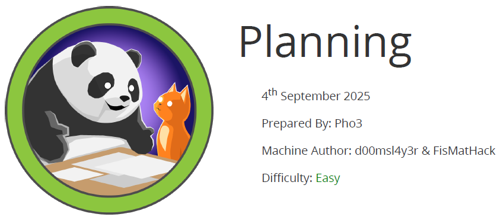

git rebase --skip

# Scope

Planning is a Linux machine that involves web enumeration, subdomain fuzzing, and exploitation of a vulnerable Grafana instance (CVE-2024-9264).
After gaining initial access to a Docker container, an exposed password allows lateral movement to the host system due to password reuse.
Finally, a custom Crontab UI management application running with root privileges can be leveraged to achieve full system compromise.

# Index
- [Enumeration](Enumeration.md)
- [Fuzzing](Fuzzing.md)
- [Foothold](Foothold.md)
- [Exploitation](Exploitation.md)
- [Priv Escalation](Priv_Escalation.md)
- [Software Versions](Software_Versions.md)

Go back to [Hack-The_Box_CTF](https://github.com/ChusLee/Hack-The-Box_CTF)
