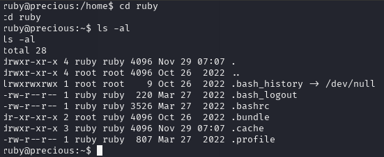
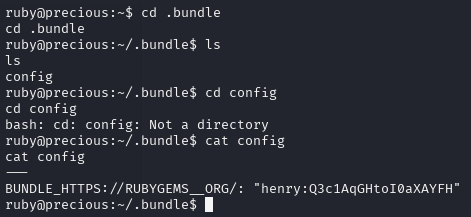
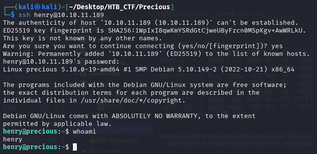

Enumerating our user's home directory reveals a .bundle directory, which commonly hosts configuration files used by Gem and other Ruby repositories.

Inside the aforementioned directory, we can find a config file which reveals some plain-text credentials for the henry user. This configuration file typically stores bundler options, allowing users to save their credentials for each Gem source. It is never a good idea to re-use passwords, and in this case this leak gives us SSH access to the henry user.

We can now SSH into the box using the credentials henry:Q3c1AqGHtoI0aXAYFH

And we got a user flag → fc4d528219a2fe0246003f2f0626686e

[Back](README.md)