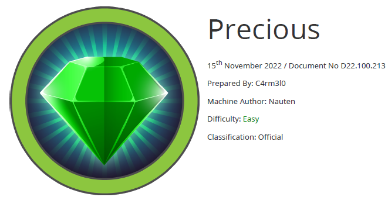

# Scope

Precious is an Easy Difficulty Linux machine, that focuses on the Ruby language. It hosts a custom Ruby web application, using an outdated library, namely pdfkit, which is vulnerable to CVE-2022-25765 , leading to an initial shell on the target machine. After a pivot using plaintext credentials that are found in a Gem repository config file, the box concludes with an insecure deserialization attack on a custom, outdated, Ruby script.

# Index
- [Enumeration](Enumeration.md)
- [Foothold](Foothold.md)
- [Lateral Movement](Lateral_Movement.md)
- [Priv Escalation](Priv_Escalation.md)
- [Software Versions](Software_Versions.md)

Go back to [Hack-The-Box_CTF](https://github.com/ChusLee/Hack-The-Box_CTF)