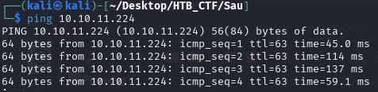
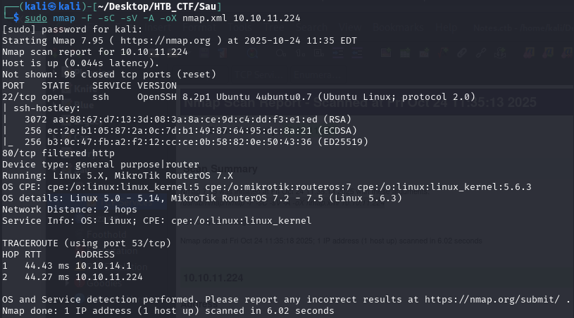
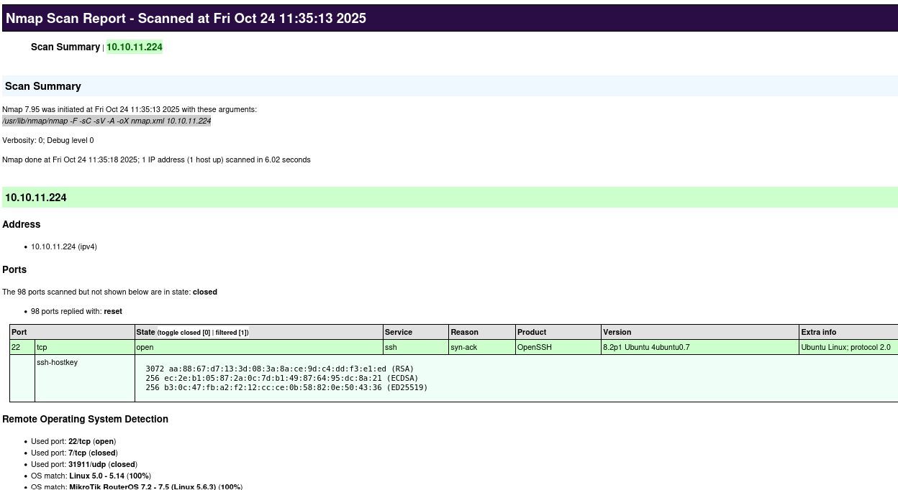
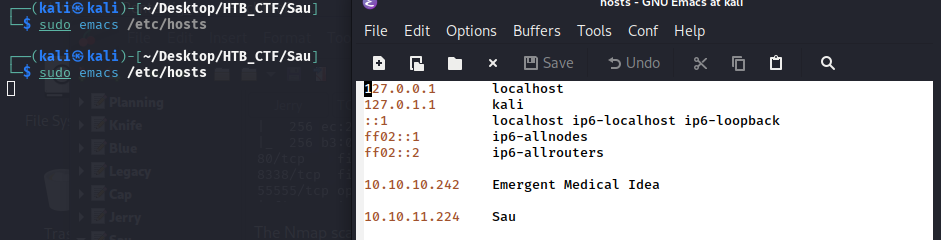
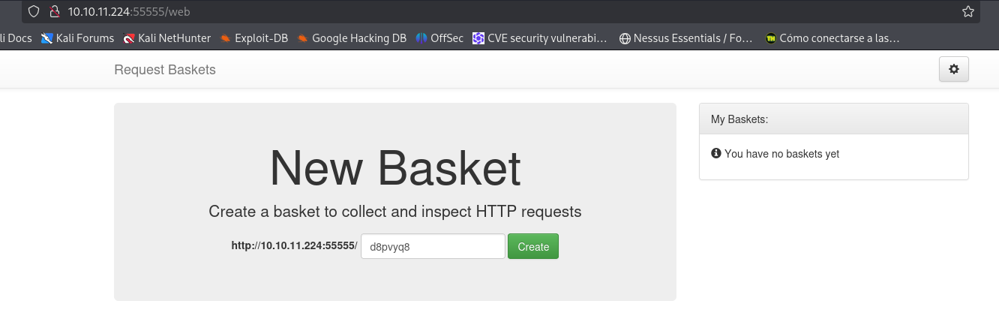

First of all we check that we have connection with IP target.



This TTL value on HTB indicates that is a Linux machine.

We will start with our usual Nmap scan and find two ports open. We find OpenSSH on port 22. The port 80 is filtered.
```bash
$ sudo nmap -F -sC -sV -A -oX nmap.xml 10.10.11.68
$ xsltproc nmap.xml -o nmap.html
```
-F → Scans fewer ports than the default: it scans the set of "top" ports from nmap-services (roughly the top 100 most common ports).

-sC → Run the default NSE (Nmap Scripting Engine) scripts against the target(s).

-sV → Service/version detection.

-A → Performs OS Detection Scan to determinate the OS of the target.

-oX → Output option: write results in XML format to file nmap.xml.  Other formats: -oN (normal), -oG (grepable), -oA (all formats).





Doing a new nmap scan...


The Nmap scan shows that OpenSSH is running on its default port, i.e. port 22 . Port 80 is open but in a filtered state. Port 8338 is also open and filtered, and there is an additional service listening on port 55555 , which responds to HTTP requests.

As port 80 is filtered, we begin our enumeration by browsing to port 55555 and see that there is a request-baskets instance running. Request Baskets is a web service to collect arbitrary HTTP requests and inspect them via RESTful API or a simple web interface.






[Back](README.md)