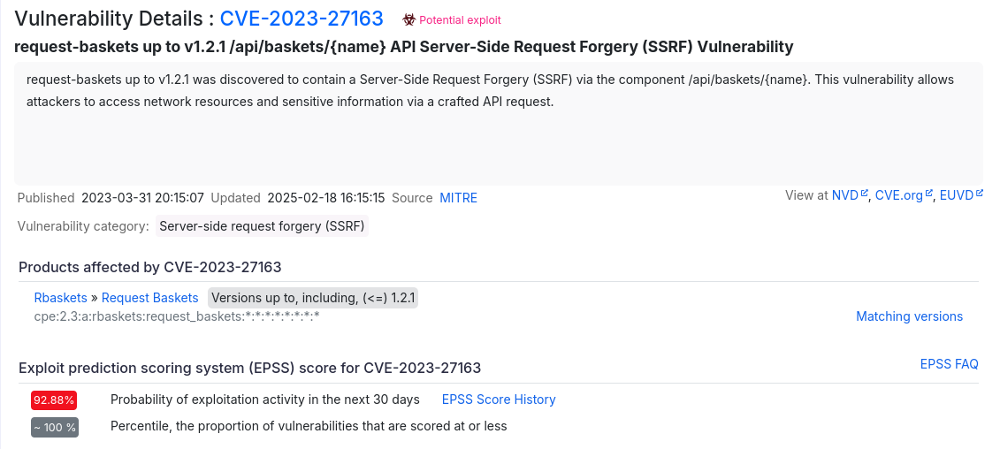
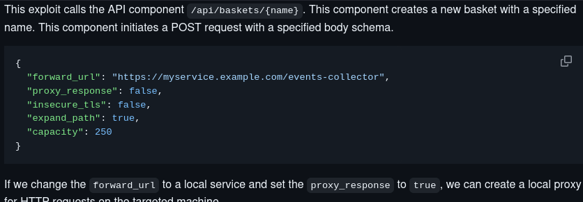
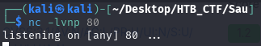
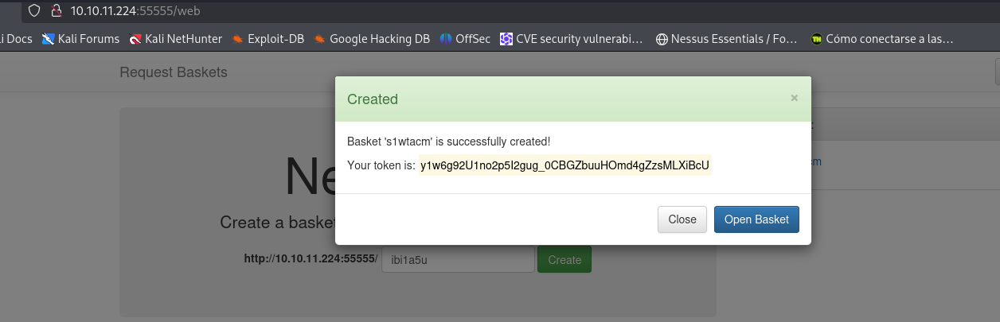
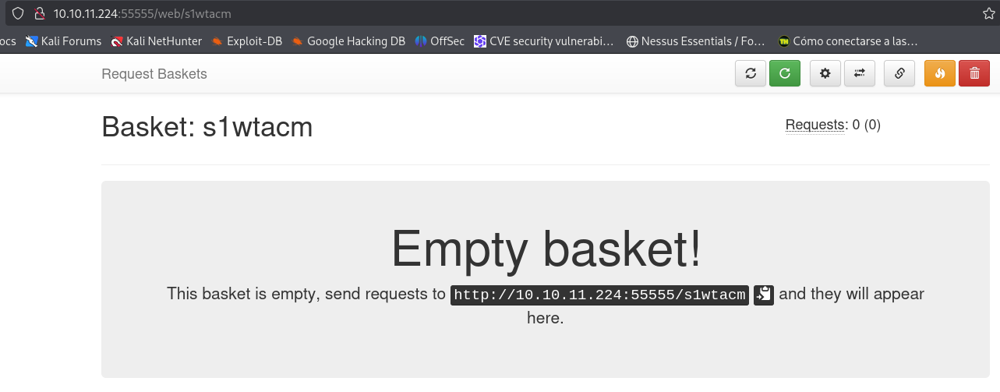
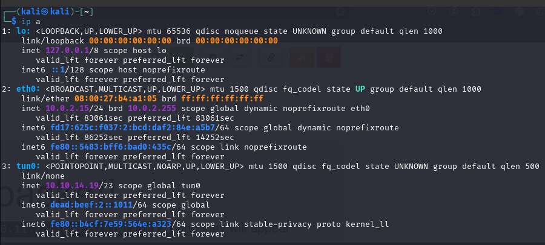
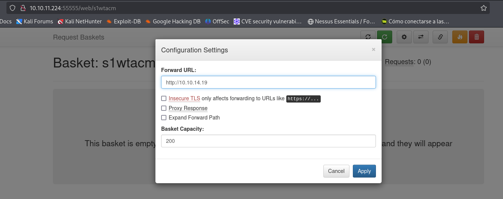
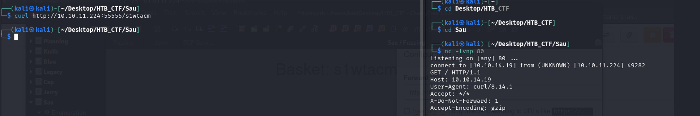
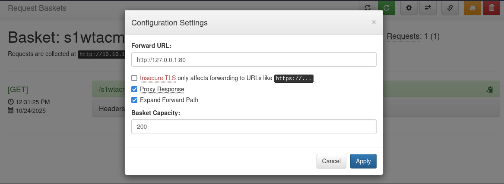
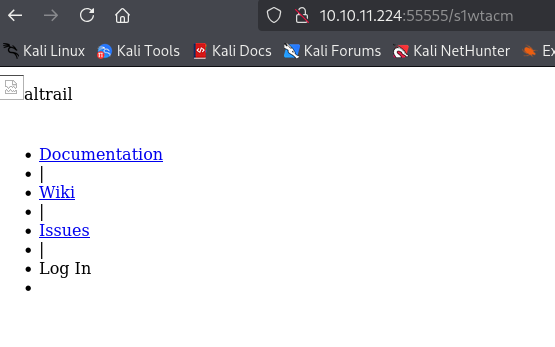

Looking at the footer we see the version that is running is Version: 1.2.1 . A quick Google search reveals that it is vulnerable to Server-Side Request Forgery (SSRF) CVE-2023-27163 via the component /api/baskets/{name} . 

This vulnerability allows attackers to access network resources and sensitive information via a crafted API request.



To see more information → https://github.com/mathias-mrsn/request-baskets-v121-ssrf



We can create a new basket to try and leverage the SSRF vulnerability to enumerate internal services running on the machine.

To test if the instance is vulnerable we first start a Netcat listener on port 80 and then try to send an HTTP request to our IP.









Since we have our Netcat listener up and running, we can proceed to initiate a request to determine if a connection is established with our listener. To achieve this, we must modify the request URL within the created basket to match our attacking machine's IP address.

We click the gear sign at the top-left corner of our basket to bring up the configuration settings. And we need to know our IP address.





We can now try to send the GET request to our basket and see if we receive anything on our Netcat listener.
```bash
$ curl http://10.10.11.224:55555/s1wtacm  (in our basket we can obtain this URL)
```



We see that we received the request we sent on our Netcat listener.

Since we've discovered the instance is vulnerable and the Nmap scan showed port 80 as filtered,we can use this to check which service runs on the port. We'll edit our proxy configuration again and set the forwarding URL to http://127.0.0.1:80 . We also enable the following settings:



We access the actual request collector, not the basket path via our browser. The URL ought to look like this: http://10.10.11.224:55555/<id> 

id = s1wtacm in our personal case.



Here, we see a Maltrail instance running. Looking at the footer, we can see that the version that is running is Maltrail (v0.53) . A quick Google search reveals that this version is vulnerable to this unauthenticated OS Command Injection. → https://github.com/Rubioo02/Maltrail-v0.53-RCE


[Back](README.md)