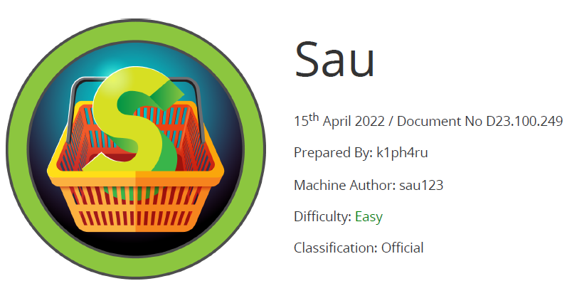

# Scope

Sau is an Easy Difficulty Linux machine that features a Request Baskets instance that is vulnerable to Server-Side Request Forgery (SSRF) via CVE-2023-27163 . Leveraging the vulnerability we are to gain access to a Maltrail instance that is vulnerable to Unauthenticated OS Command Injection, which allows us to gain a reverse shell on the machine as puma . A sudo misconfiguration is then exploited to gain a root shell.

# Index
- [Enumeration](Enumeration.md)
- [Fuzzing](Fuzzing.md)
- [Foothold](Foothold.md)
- [Priv Escalation](Priv_Escalation.md)
- [Software Versions](Software_Versions.md)

Go back to [Hack-The-Box_CTF](https://github.com/jesuscuenca-cyber/Hack-The-Box_CTF)