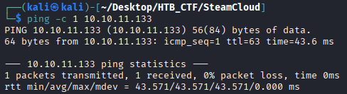
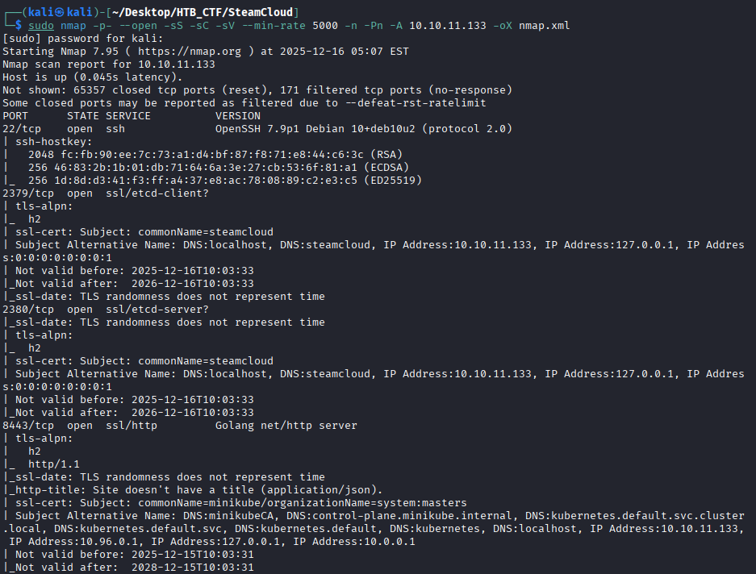
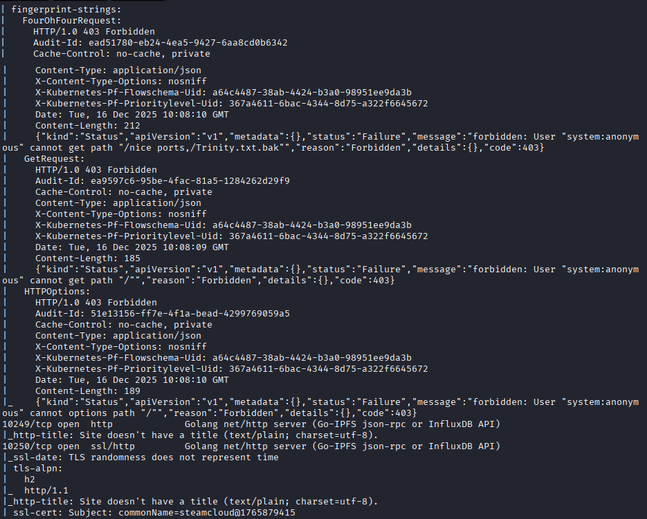
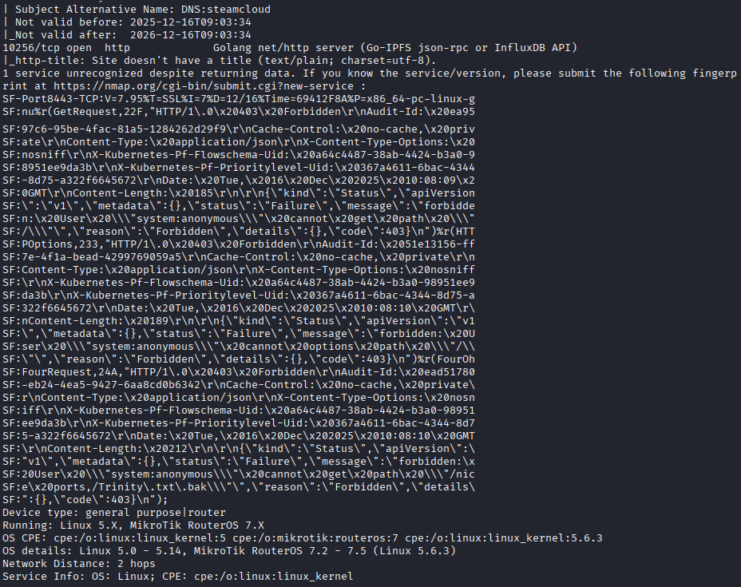
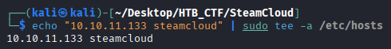
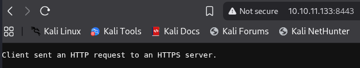
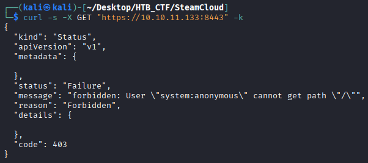
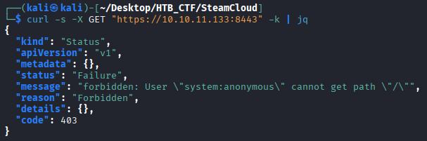
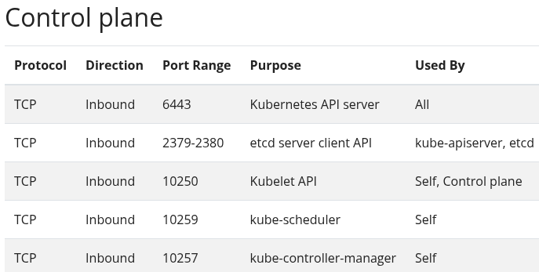
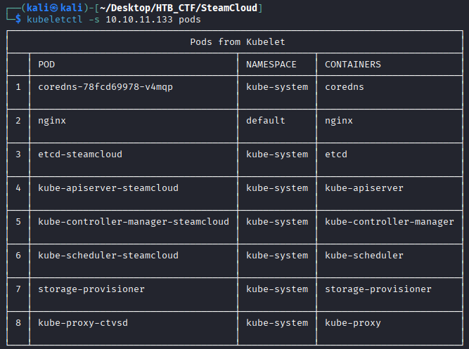

First of all we check that we have connection with IP target.
```bash
$ ping -c 1 10.10.11.133
```


This TTL value on HTB indicates that is a Linux machine.

Starting with our usual Nmap scan, we see several ports are open. SSH defaulting to port 22. Etcd, a kubernetes component, listens on port 2379 as a client and 2380 as a server. Kubelet, a kubernetes extension, listens on port 10250 by default, and the kubernetes API listens on port 8443. Let's have a look at the Kubernetes API, which is accessible on port 8443.
```bash
$ sudo nmap -p- --open -sS -sC -sV --min-rate 5000 -n -Pn -A 10.10.11.11  -oX nmap.xml
$ xsltproc nmap.xml -o nmap.html
```
-p- → Scans all 65,535 TCP ports, not just the most common ones. All 65,535 TCP ports, not just the most common ones, not just the most common ones. 

--open → Shows only ports that are open, filtering out closed or filtered ones.

-sS → Performs a TCP SYN scan (half-open scan), which is fast and stealthy and requires root privileges.

-sC → Runs default NSE (Nmap Scripting Engine) scripts to gather additional information such as common vulnerabilities and service details.

-sV → Attempts to detect service versions running on open ports.

--min-rate 5000 → Forces Nmap to send at least 5000 packets per second, speeding up the scan but increasing the chance of detection or packet loss. 

-n →  Disables DNS resolution to make the scan faster.

-Pn → Skips host discovery and assumes the target is alive, useful when ICMP is blocked.

-A → Enables aggressive scan options, including OS detection, version detection, script scanning, and traceroute.

-oX → Output option: write results in XML format to file nmap.xml.  Other formats: -oN (normal), -oG (grepable), -oA (all formats).






To access the website, we must add the domain name cicada.htb to our /etc/hosts file to resolve the connection with the IP address.
```bash
$ echo "10.10.11.133 cicada.htb" | sudo tee -a /etc/hosts
```


We try to access via browser trhow the 8443 port, but doesn't work.



So we try to do an HTTPS web request to port 8443 on the machine 10.10.11.133 and show me the response.
```bash
$ curl -s -X GET "https://10.10.11.133:8443" -k
```
curl → command-line tool used to make HTTP/HTTPS requests.

-s → silent mode (hides progress and error messages).

-X GET → specifies the HTTP method to use (GET). 

-k → disables SSL/TLS certificate verification (accepts self-signed or invalid certificates)



To get a view more polite we can use de jq tool (jason) like this
```bash
$ curl -s -X GET "https://10.10.11.133:8443" -k | jq
```


After researching Kubernetes, we see that the default port for the API is usually 443, but in our case that port is not available. Therefore, we take another careful look at the Nmap scan performed earlier and notice that there is an API calledminikube, which we know from searching on Google uses port 8443 by default. To interact with it, we will use the tool, with the help of the following resource:
https://cloud.hacktricks.wiki/en/pentesting-cloud/kubernetes-security/kubernetes-basics.html#kubectl-basics


As we can see, credentials are required. So we need to change the way. So let's continue on to the port 10250 because serarching on google we found that the prupose of this port is Kubelet API (https://kubernetes.io/docs/reference/networking/ports-and-protocols/)



Install Kubeletctl tool → https://github.com/cyberark/kubeletctl

So let's continue on to the Kubelet service, which is listening at port 10250.
```bash
$ kubeletctl -s 10.10.11.133 pods
```



A list of all the pods is successfully returned.


[Back](README.md)