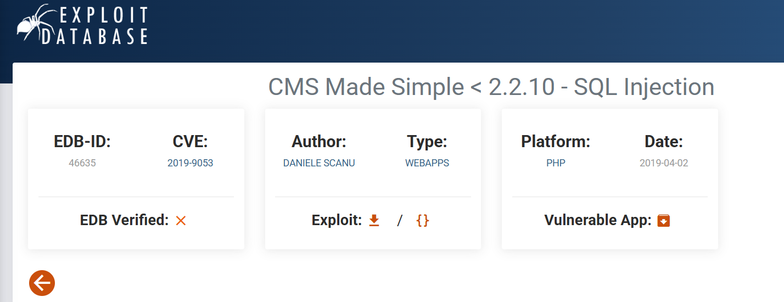
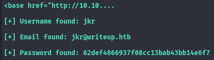
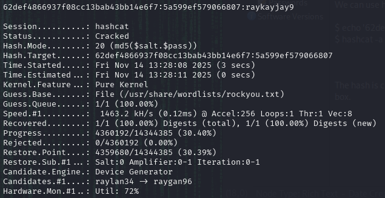
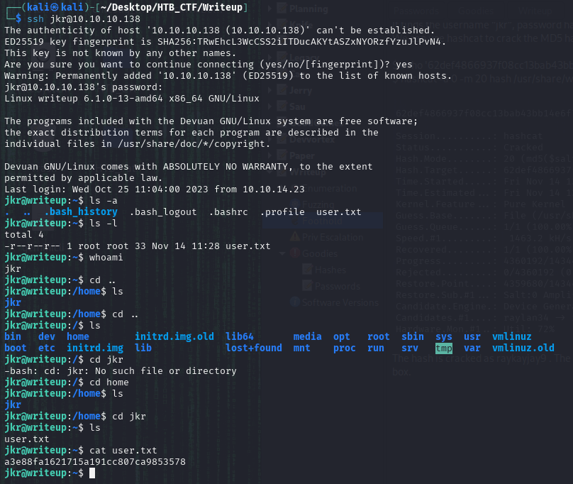

Going to exploit-db and searching for this service leads us to a SQL injection vulnerability from the same year ( CVE-2019-9053 ). Looking at the proof of concept (PoC) script, we see that it’s exploiting a time-based, blind injection:



Going to exploit-db and searching for this service leads us to a SQL injection vulnerability from the same year ( CVE-2019-9053 ). Looking at the proof of concept (PoC) script.

We download the script and supply it with the URL of our target.  https://github.com/so1icitx/CVE-2019-9053



It finds the username “jkr”, password hash, and the salt.
We can use hashcat to crack the MD5 hash. Copy the hash into a file in the format hash:salt and then use mode 20 to crack it:
```bash
$ echo '62def4866937f08cc13bab43bb14e6f7:5a599ef579066807' > hash
$ hashcat -a 0 -m 20 hash /usr/share/wordlists/rockyou.txt
```



The hash is cracked as raykayjay9 . The credentials jkr:raykayjay9 are used to SSH into the box.



Now we got the user flag.

[Back](README.md)