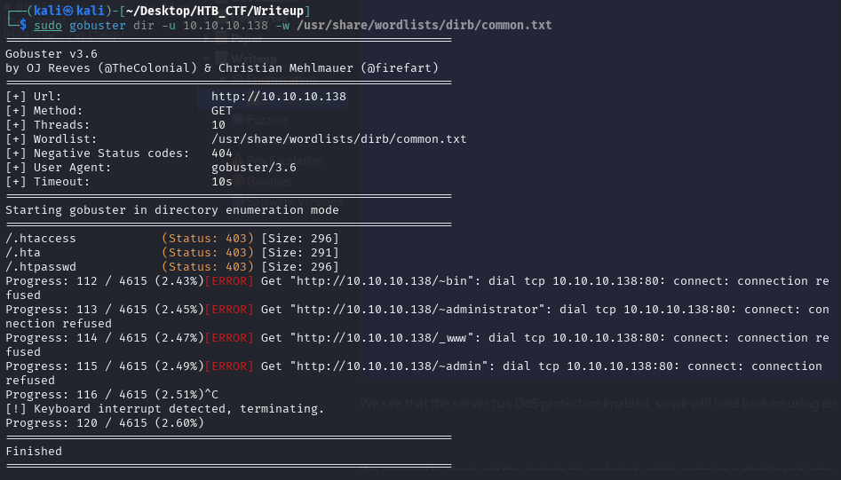
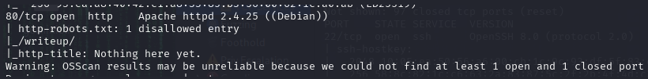
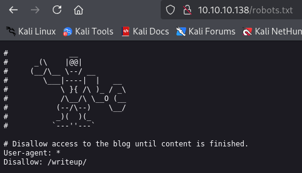
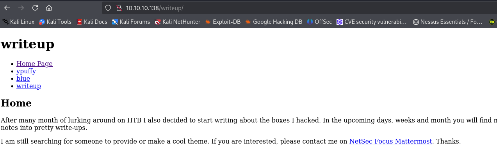
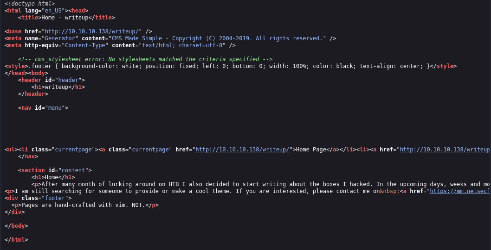

We see that the server has DoS protection enabled, so we will hold back on using directory scanners and fuzzers for enumeration as we can see.

We proceed to check out the /robots.txt endpoint, which contains a disallowed entry, namely /writeup/ .

If we take a look at the page's HTML source, we find the following metadata in the site's header:

We now know that the site is running CMS Made Simple . Furthermore, we see that the Copyright is for 2004-2019, so this must be a 2019 version.

[Back](README.md)