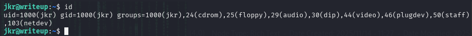
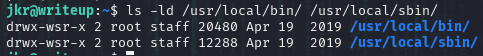
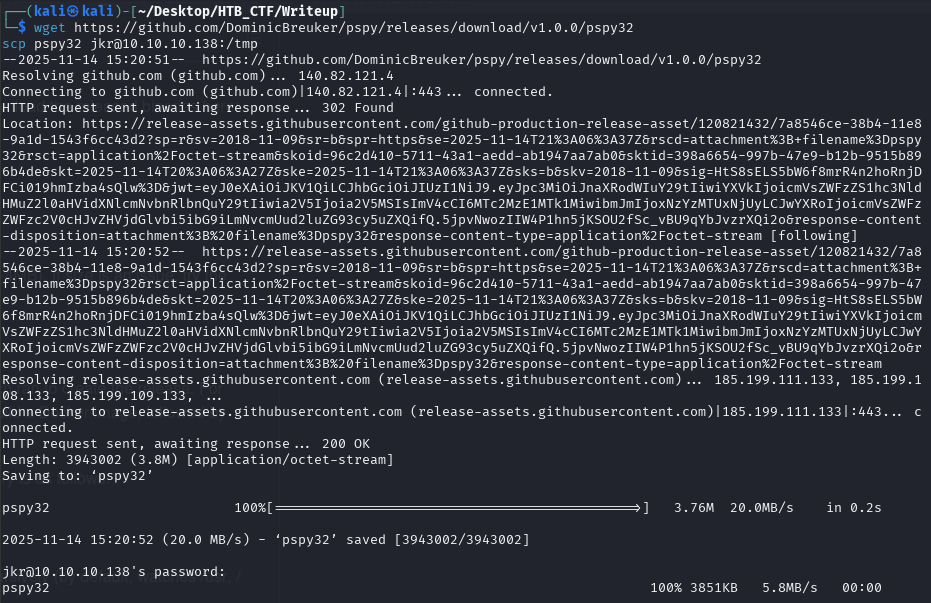
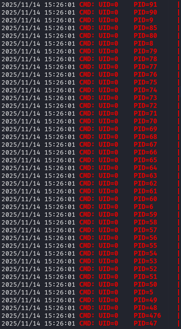
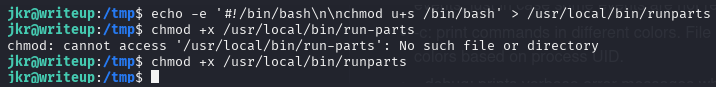
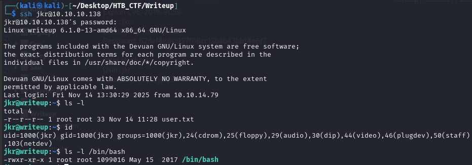
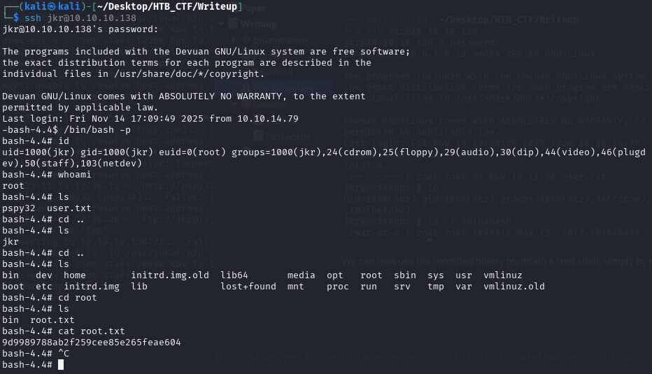

We start our enumeration by looking at our user's groups.



Searching information about debian we find the following.

staff (50): Allows limited administrative tasks or shared access.

As staff , we can write to /usr/local/bin and /usr/local/sbin :



To see what the root user might be doing on the system, we upload pspy to the machine. → https://github.com/DominicBreuker/pspy



We run the tool in one shell and proceed to SSH into the box via another shell.
```bash
jkr@writeup:~$ cd /tmp
jkr@writeup:/tmp/$ chmod +x pspy32
jkr@writeup:/tmp/$ ./pspy32
```




As we SSH into the machine, root uses sh to run /usr/bin/env , and we see that motd was called and the file 10-uname was accessed. We also see that the PATH specified before running run-parts includes two directories that we can write to, at the very start.


## Path Hijacking

With that in mind, we will now create a malicious run-parts file in /usr/local/bin , which we know will be executed as soon as we SSH into the machine.

Using the following one-liner, we create an executable payload that will turn the bash binary into an SUID binary, effectively giving us a root shell.
```bash
$ echo -e '#!/bin/bash\n\nchmod u+s /bin/bash' > /usr/local/bin/runparts
$ chmod +x /usr/local/bin/runparts
```



Now, as soon as we SSH into the machine as jkr , we see that our payload was triggered, as the SUID bit is set on /bin/bash 



We can now use the modified binary to obtain a root shell, simply by running it using the -p flag to maintain the privileges.



Finally we got the root flag.

[Back](README.md)