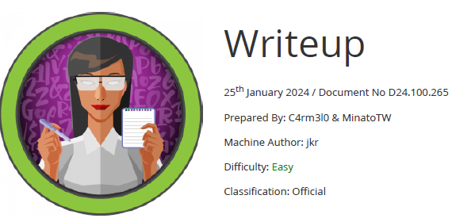

# Scope

Writeup is an easy difficulty Linux box with DoS protection in place to prevent brute forcing. A CMS susceptible to a SQL injection vulnerability is found, witch is leveraged to gain user credentials. The user is found to be in a non-default group, which has write access to part of the PATH. A path hijacking results in escalation of privileges to root.

# Index
- [Enumeration](Enumeration.md)
- [Fuzzing](Fuzzing.md)
- [Foothold](Foothold.md)
- [Priv Escalation](Priv_Escalation.md)
- [Software Versions](Software_Versions.md)

Go back to [Hack-The-Box_CTF](https://github.com/ChusLee/Hack-The-Box_CTF)